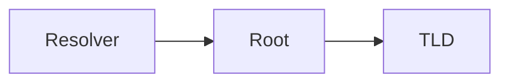

# Post body markup

The markdown machinery available inside a post body, beyond plain
CommonMark. For frontmatter, scheduling, and file locations, see
[post frontmatter and scheduling](post-frontmatter.md).

## Headings

`PostDetails.astro` renders the frontmatter `title` as the page `h1`.
Body headings start at `h2`.

## Table of contents

A literal `## Table of contents` heading in the body becomes a
collapsible table of contents. `remark-toc` fills the section from the
headings that follow it, and `remark-collapse` wraps it in a `details`
element. `astro.config.ts` wires both, and `remark-collapse` matches the
heading text exactly.

Posts without that heading render no table of contents.

## Images

Three storage locations, differing in optimisation and path form.

| Location | Optimised | Path in the body |
| --- | --- | --- |
| `src/assets/` | yes | `@/assets/…` or a relative path |
| `public/` | no | absolute, `/…` |
| Remote host | no | absolute URL |

Images under `src/assets/` pass through Astro's image service. Reference
them with the `@/assets/` alias or with a path relative to the post file,
which varies by folder depth—two `../` from `src/data/blog/<slug>.md`,
three from `src/data/blog/reviews/<slug>.md`:

```md


```

Optimised images resolve through markdown image syntax only. An `img`
tag pointing at `@/assets/` or at a relative path doesn't resolve.

Optimised images don't reach the RSS feed. It renders post bodies outside
the page build, so a `src/assets/` image arrives in a feed reader as a
broken path. Images under `public/` and on a remote host carry over
intact.

Astro serves files under `public/` untouched at an absolute path. They
work in both markdown image syntax and an `img` tag:

```md

```

Astro's image settings are `layout: "constrained"` and
`responsiveStyles: true`, so optimised images carry responsive styles and
scale down within their container.

`ogImage` is frontmatter rather than body markup; see
[post frontmatter and scheduling](post-frontmatter.md).

## Theme-aware images

An image under `public/` that has a `-dark` sibling swaps with the site
theme. Name the pair by suffix and reference only the light one:

```md

```

With `public/assets/example-dark.svg` present, that swaps with the theme
toggle. Without it, the image renders unchanged.

Three limits apply:

- Only `public/` images pair. An image under `src/assets/` reaches the
  page with a hashed build path that has no predictable sibling.
- Both variants share the one `alt`, so write it without naming a
  colour or a brightness—the streak that is darkest in one theme is
  brightest in the other.
- The RSS feed and the `index.md` endpoint carry the light variant only.
  They render the body outside the page, where no theme applies.

`scripts/contributions-heatmap.py` generates such a pair.

## Code blocks

Shiki highlights fenced code blocks. It carries dual themes, `min-light`
and `night-owl`, matching the site's light and dark mode. Long lines
scroll rather than wrap.

A `file` attribute on the fence info string renders a filename label on
the block:

````md
```ts file="src/content.config.ts"
export const collections = { blog };
```
````

Comments in the code drive three enabled `@shikijs/transformers`
notation transformers:

| Transformer | Notation |
| --- | --- |
| `transformerNotationHighlight` | `[!code highlight]` |
| `transformerNotationWordHighlight` | `[!code word:…]` |
| `transformerNotationDiff` | `[!code ++]`, `[!code --]` |

Rendering strips the notation comment from the output. For the full
syntax, including ranges, see the
[@shikijs/transformers documentation](https://shiki.style/packages/transformers).

## Diagrams

A `mermaid` fence renders as a diagram. Write the diagram in
[Mermaid](https://mermaid.js.org) syntax, so it diffs in git the way the
rest of the post does:

````md

````

The `astro-mermaid` integration in `astro.config.ts` handles this. It
takes the fence out of Shiki's hands at build time and renders it in the
browser. The diagram follows the site theme toggle, in Mermaid's own
`default` and `dark` palettes.

Three limits apply:

- Mermaid runs in the browser. Without JavaScript the fence shows its
  own source as a plain block of text.
- Only a page holding a diagram loads Mermaid. A post without one
  downloads nothing extra.
- The RSS feed, the `index.md` endpoint, and `llms.txt` carry the fence
  as source text. They render the body outside the page, where nothing
  runs it.
